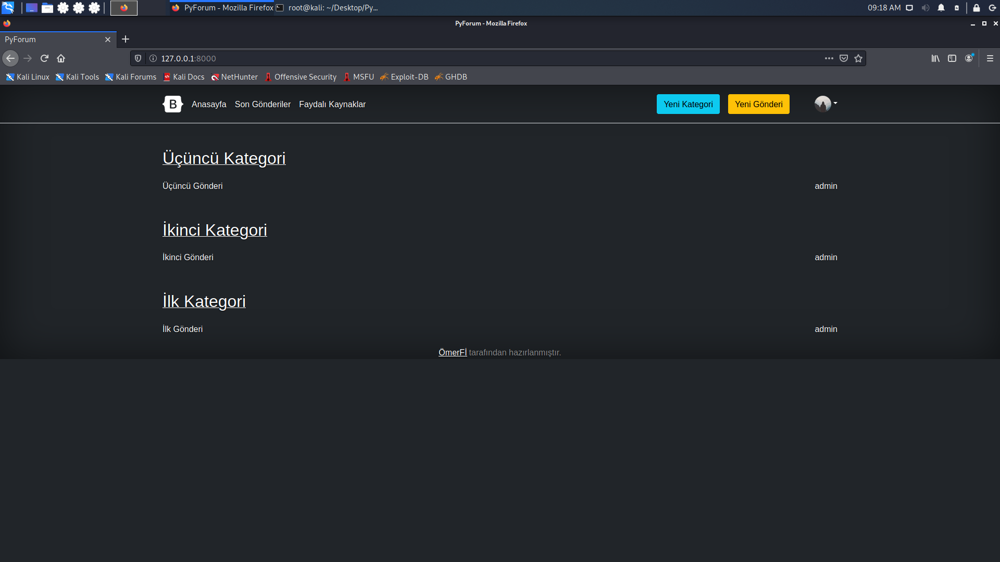
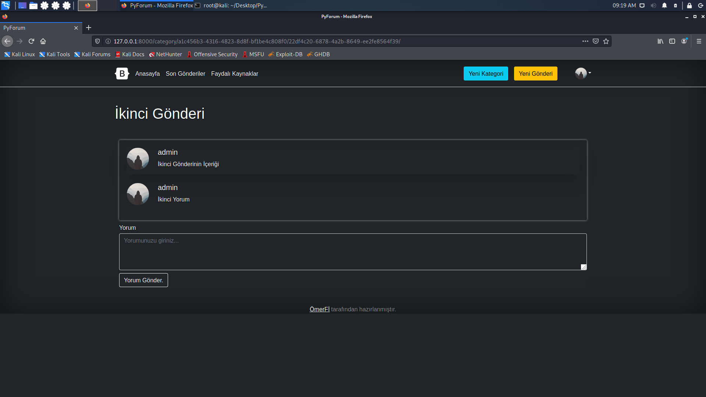

# PyForum

PyForum is a full-stack web application made using **Django** on the backend and **React** on the frontend.




## How to test

Requires `Python 3.6+` and `Nodejs`.

```bash
git clone https://github.com/OmerFI/PyForum.git
cd PyForum/frontend
npm install
npm run build
cd ../backend
pip install -r requirements.txt
python3 manage.py migrate
python3 manage.py runserver
```

There are no categories by default, but if you are an admin user, you can create them by clicking on the `Yeni Kategori` button in the top right corner.

You can create an admin user using the following command:

```bash
python3 manage.py createsuperuser
```

Note: This site's language is `Turkish`

### Features:

- Users can register and log in.
- Users can create a post in categories.
- Any user can comment in a post.
- Users can delete their comments.
- Every user has a profile and in the profile, there are posts which the user has posted.
- Users can edit his profile image, firstname and surname.
- In main page, there are categories and posts. Each category has maximum 5 posts in main page. If there are more than 5 posts, then a link to the category details page appears.
